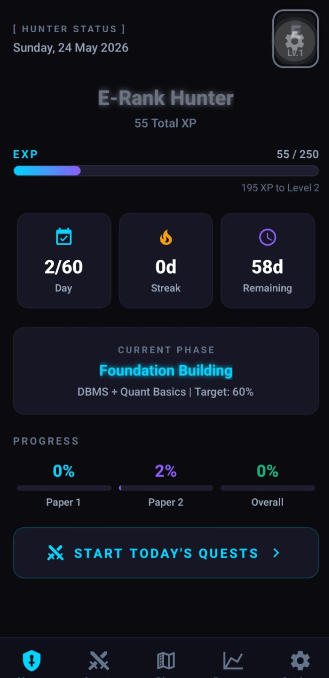
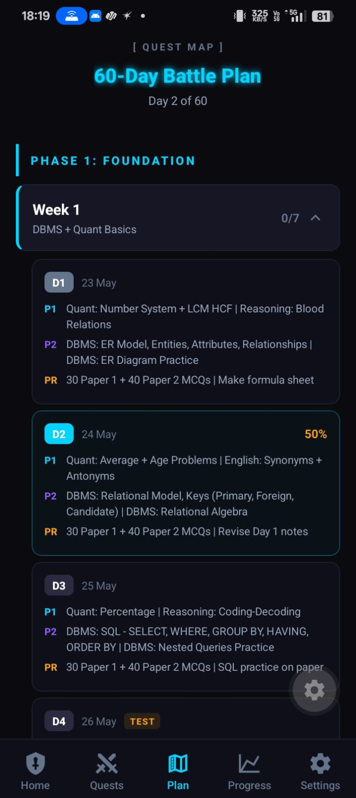

<p align="center">
  
</p>

<h1 align="center">Ranker System</h1>

<p align="center">
  <strong>Your 60-Day Exam Prep, Gamified.</strong>
</p>

<p align="center">
  <em>Inspired by Solo Leveling — turn your study grind into an RPG quest system with XP, ranks, streaks, and battle phases.</em>
</p>

<p align="center">
  
  
  
  
</p>

---

## Screenshots

<p align="center">
  
  &nbsp;&nbsp;&nbsp;&nbsp;
  
</p>

<p align="center">
  <sub><b>Left:</b> Hunter Status Dashboard &nbsp;|&nbsp; <b>Right:</b> Quest Map with Timeline</sub>
</p>

---

## What is Ranker System?

Ranker System is a mobile app that transforms a 60-day competitive exam preparation schedule into a game. Every study session is a **quest**, every completed day earns **XP**, and you climb through **hunter ranks** as you progress.

No more boring spreadsheets. No more missed study days without consequence. This app makes you **want** to study.

---

## Features

### Quest System
- **60-Day Battle Plan** — Structured schedule across 4 phases with daily quests
- **Paper 1 + Paper 2 + Practice** — Categorized tasks covering Quant, Reasoning, English, DBMS, OS, CN, DSA, and more
- **Difficulty Tiers** — Easy, Normal, Hard, and Boss-level quests with scaled XP rewards

### Gamification
- **XP & Leveling** — 250 XP per level, earn through completing quests and maintaining streaks
- **Rank Progression** — Climb from E-Rank to National Level Hunter
- **Streak Bonuses** — 3-day streak (+30 XP), 7-day streak (+100 XP), daily completion bonus (+50 XP)
- **Penalties** — Miss the 60% completion threshold and face XP penalties
- **Sound Effects** — Level up celebrations, quest completions, and penalty warnings

### Progress Tracking
- **Subject-wise Analytics** — See completion rates per subject
- **Mock Test Scores** — Log and visualize mock performance over time
- **Error Notebook** — Record mistakes, tag concepts, and schedule revisions
- **Phase Progress** — Track your score targets across Foundation, Core, Completion, and Mock phases

### Quest Map (Study Plan)
- **Timeline View** — Vertical timeline connecting daily tasks with phase-colored indicators
- **Week Progress Bars** — Visual completion tracking per week
- **Auto-scroll to Today** — Opens directly at your current position
- **Jump to Today FAB** — Floating button to snap back when browsing other weeks
- **Status Indicators** — Cyan (today), Green (completed), Amber (missed), Dark (upcoming)

---

## Rank Progression

```
 Lv. 1-5    ░░░░░░░░░░  E-Rank Hunter
 Lv. 6-10   ██░░░░░░░░  D-Rank Hunter
 Lv. 11-15  ████░░░░░░  C-Rank Hunter
 Lv. 16-22  ██████░░░░  B-Rank Hunter
 Lv. 23-30  ████████░░  A-Rank Hunter
 Lv. 31-40  ██████████  S-Rank Hunter
 Lv. 41+    ██████████  National Level Hunter
```

---

## Battle Phases

| Phase | Focus | Target | Color |
|:------|:------|:-------|:------|
| **Foundation** | DBMS + Quant Basics | 60% | Cyan |
| **Core Building** | Advanced Topics (OS, CN, DSA) | 70% | Purple |
| **Completion** | Full Syllabus Coverage | 80% | Amber |
| **Mock Intensive** | Mock Tests + Revision | 85%+ | Red |

---

## Tech Stack

| Layer | Technology |
|:------|:-----------|
| Framework | React Native + Expo SDK 56 |
| Language | TypeScript 6.0 |
| State | Zustand + AsyncStorage |
| Navigation | React Navigation 7 (Bottom Tabs + Native Stack) |
| Animations | React Native Reanimated 4 |
| Styling | NativeWind (Tailwind CSS) |

---

## Project Structure

```
src/
├── components/           # Reusable UI components
│   ├── GlowText.tsx          # Glowing text with neon shadow
│   ├── QuestCard.tsx         # Individual quest display
│   ├── RankBadge.tsx         # Animated rank tier badge
│   ├── StatCard.tsx          # Stats display card
│   ├── XPBar.tsx             # Experience progress bar
│   ├── LevelUpModal.tsx      # Level up celebration
│   └── PenaltyModal.tsx      # Missed day penalty warning
│
├── screens/              # App screens
│   ├── HomeScreen.tsx        # Hunter status dashboard
│   ├── DailyQuestsScreen.tsx # Today's quest list
│   ├── StudyPlanScreen.tsx   # 60-day quest map timeline
│   ├── ProgressScreen.tsx    # Analytics and stats
│   ├── SettingsScreen.tsx    # App settings
│   ├── ErrorNotebookScreen.tsx # Mistake tracker
│   └── SplashScreen.tsx      # Launch screen
│
├── constants/            # Data and configuration
│   ├── studyPlan.ts          # Full 60-day study schedule
│   ├── types.ts              # TypeScript interfaces
│   ├── theme.ts              # Colors and design tokens
│   └── xp.ts                 # XP values, ranks, subjects
│
├── store/                # State management
│   ├── useGameStore.ts       # Zustand game state
│   └── storage.ts            # AsyncStorage persistence
│
├── utils/                # Helpers
│   ├── dateUtils.ts          # Date calculations
│   ├── notifications.ts      # Push notifications
│   ├── sound.ts              # Sound effects
│   └── xpCalculator.ts       # XP and level math
│
└── navigation/           # Navigation
    └── AppNavigator.tsx      # Tab + Stack navigator
```

---

## Getting Started

### Prerequisites
- Node.js 18+
- Expo CLI (`npm install -g expo-cli`)
- Android device or emulator

### Installation

```bash
# Clone the repo
git clone https://github.com/AakashShah07/Ranker-System-.git
cd Ranker-System-

# Install dependencies
npm install

# Start dev server
npx expo start

# Run on Android
npx expo start --android
```

### Build APK

```bash
# Install EAS CLI
npm install -g eas-cli

# Login to Expo
eas login

# Build APK
eas build -p android --profile preview
```

---

## XP System

| Action | XP |
|:-------|---:|
| Easy Quest | +10 |
| Normal Quest | +20 |
| Hard Quest | +35 |
| Boss Quest | +60 |
| Daily Completion Bonus | +50 |
| 3-Day Streak Bonus | +30 |
| 7-Day Streak Bonus | +100 |
| XP Per Level | 250 |

---

<p align="center">
  <sub>Built with determination by <a href="https://github.com/AakashShah07">Aakash Shah</a></sub>
</p>
